Data Descriptor - Manuscript Figures
================

------------------------------------------------------------------------

## MAP AND SAMPLE COUNT

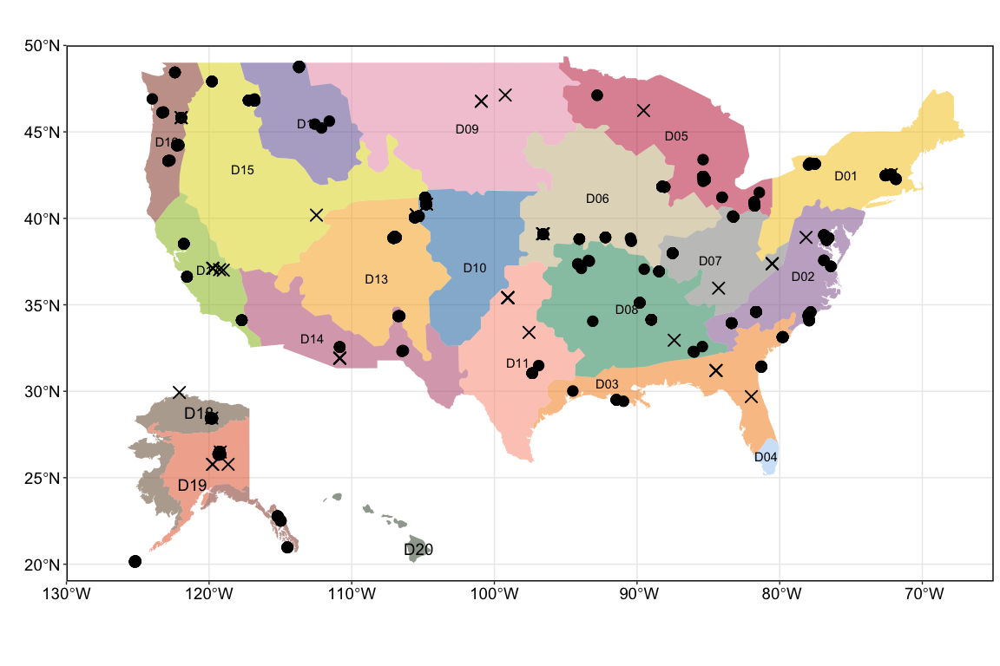<!-- -->

Note: The points represent all sampling locations (660 entries). NEON
sites are marked with “X”.

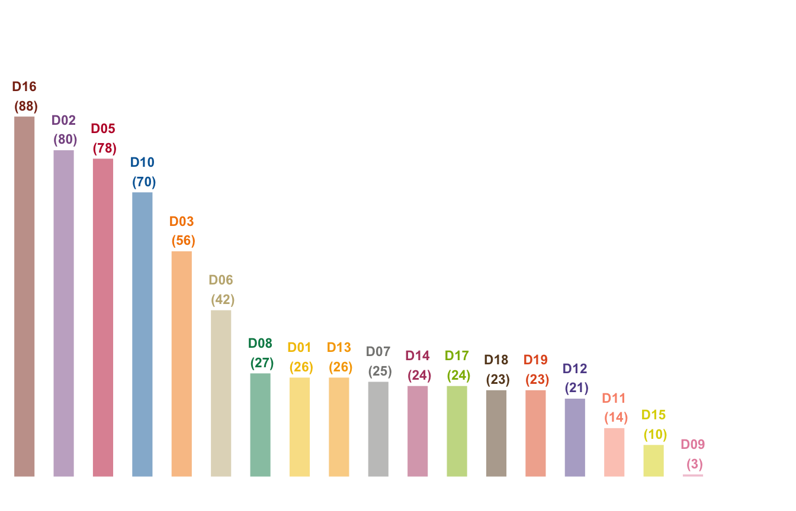<!-- -->

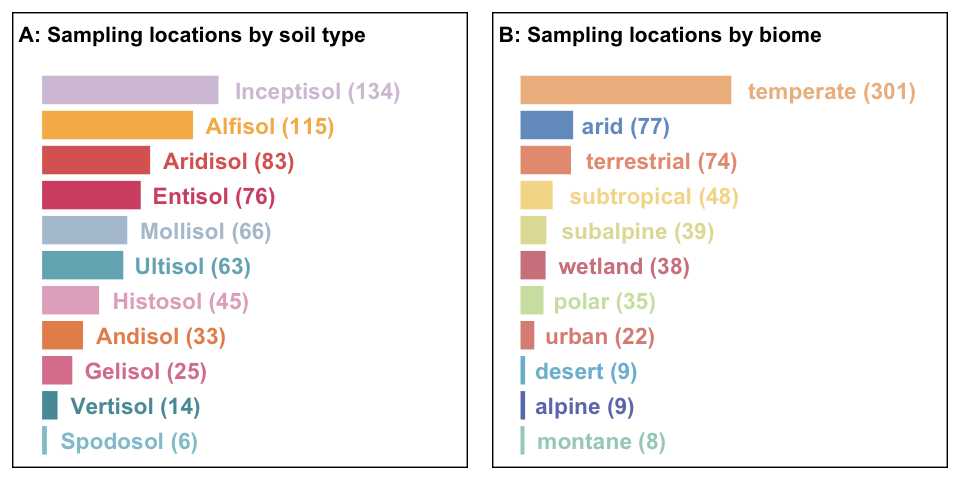<!-- -->

------------------------------------------------------------------------

How many sites and cores were sampled?

    ## [1] "number of projects"

| call |   n |
|:-----|----:|
| FY23 |  16 |
| FY24 |  26 |
| FY25 |  17 |
| FY26 |   6 |

total projects = 65

    ## [1] "number of sampling sets"

| call |   n |
|:-----|----:|
| FY23 | 146 |
| FY24 | 213 |
| FY25 | 147 |
| FY26 |  63 |

total sampling sets = 569

    ## [1] "summary by soil orders"

| soil_type  |   n | percent |
|:-----------|----:|--------:|
| Alfisol    | 114 |    20.0 |
| Andisol    |  33 |     5.8 |
| Aridisol   |  38 |     6.7 |
| Entisol    |  72 |    12.7 |
| Gelisol    |  24 |     4.2 |
| Histosol   |  44 |     7.7 |
| Inceptisol | 128 |    22.5 |
| Mollisol   |  66 |    11.6 |
| Spodosol   |   6 |     1.1 |
| Ultisol    |  30 |     5.3 |
| Vertisol   |  14 |     2.5 |

------------------------------------------------------------------------

## BGC data

### V2

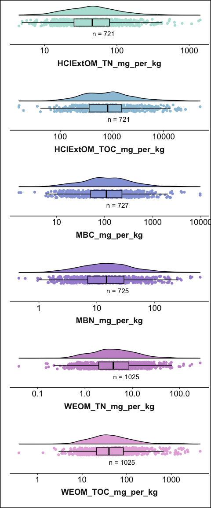<!-- -->

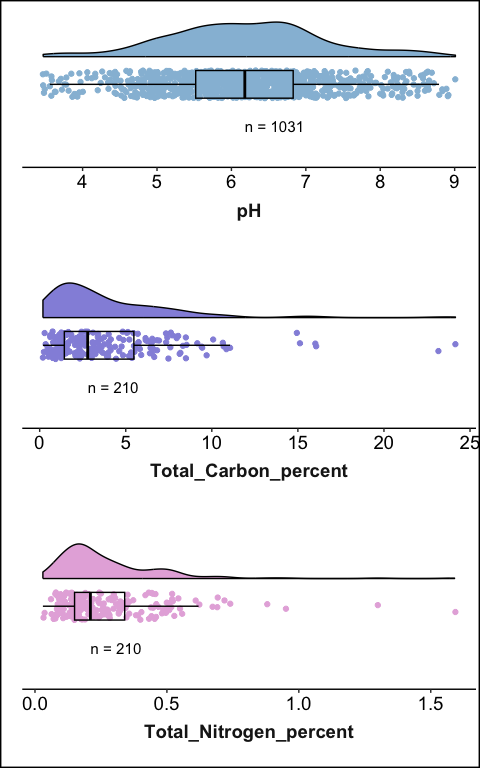<!-- -->

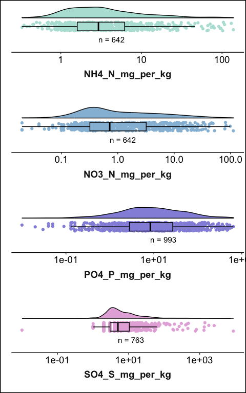<!-- -->

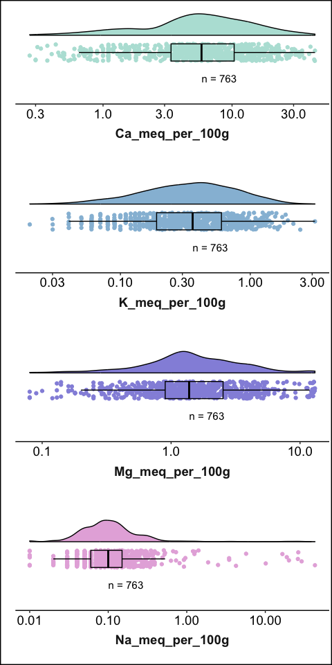<!-- -->

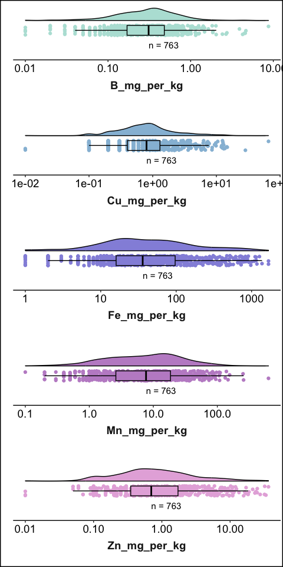<!-- -->

------------------------------------------------------------------------

## FTICR

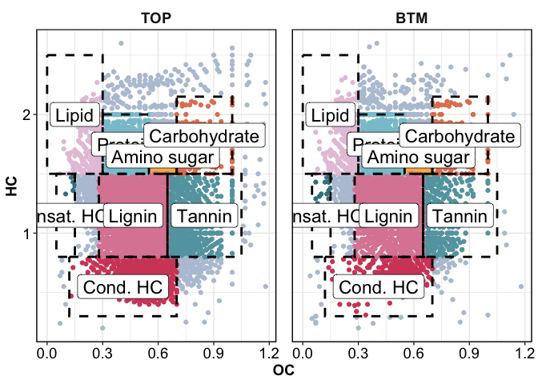<!-- -->

| sample_name | Amino Sugar | Carbohydrate | Cond Hydrocarbon | Lignin | Lipid | Other | Protein | Tannin | Unsat Hydrocarbon |
|:---|---:|---:|---:|---:|---:|---:|---:|---:|---:|
| 60933_2_TOP | 2.57 | 2.05 | 11.22 | 44.59 | 4.72 | 8.61 | 14.37 | 11.78 | 0.1 |
| 60933_2_BTM | 4.18 | 3.67 | 4.48 | 39.04 | 7.89 | 8.60 | 24.30 | 7.45 | 0.4 |

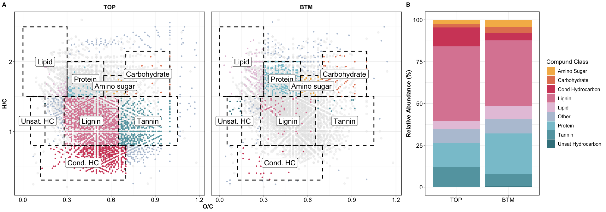<!-- -->

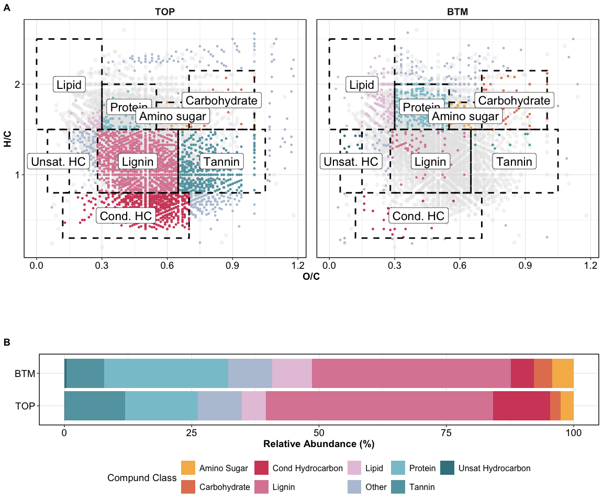<!-- -->

------------------------------------------------------------------------

## HYPROP

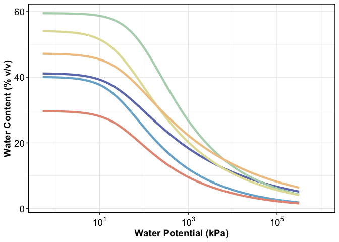<!-- -->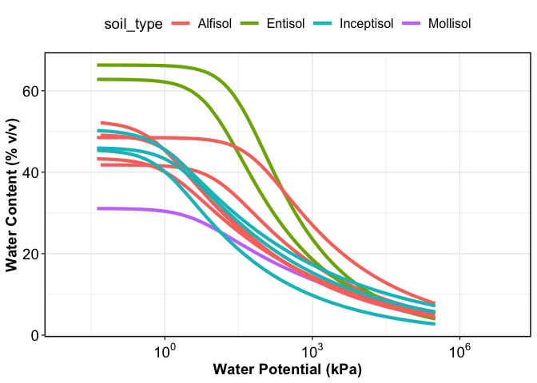<!-- -->

------------------------------------------------------------------------

## TARGETED REGRESSION PLOTS

------------------------------------------------------------------------

## Session Info

Session Info

Date run: 2026-06-10

    ## R version 4.5.0 (2025-04-11)
    ## Platform: aarch64-apple-darwin20
    ## Running under: macOS 26.5
    ## 
    ## Matrix products: default
    ## BLAS:   /Library/Frameworks/R.framework/Versions/4.5-arm64/Resources/lib/libRblas.0.dylib 
    ## LAPACK: /Library/Frameworks/R.framework/Versions/4.5-arm64/Resources/lib/libRlapack.dylib;  LAPACK version 3.12.1
    ## 
    ## locale:
    ## [1] en_US.UTF-8/en_US.UTF-8/en_US.UTF-8/C/en_US.UTF-8/en_US.UTF-8
    ## 
    ## time zone: America/Los_Angeles
    ## tzcode source: internal
    ## 
    ## attached base packages:
    ## [1] stats     graphics  grDevices utils     datasets  methods   base     
    ## 
    ## other attached packages:
    ##  [1] sf_1.0-21           whistledown_0.1.0   googlesheets4_1.1.1
    ##  [4] soilpalettes_0.1.0  PNWColors_0.1.0     magrittr_2.0.3     
    ##  [7] lubridate_1.9.4     forcats_1.0.0       stringr_1.5.1      
    ## [10] dplyr_1.2.0         purrr_1.0.4         readr_2.1.5        
    ## [13] tidyr_1.3.2         tibble_3.3.1        ggplot2_4.0.2      
    ## [16] tidyverse_2.0.0    
    ## 
    ## loaded via a namespace (and not attached):
    ##  [1] DBI_1.2.3           permute_0.9-7       rlang_1.1.7        
    ##  [4] ade4_1.7-23         snakecase_0.11.1    e1071_1.7-16       
    ##  [7] compiler_4.5.0      mgcv_1.9-1          vctrs_0.7.1        
    ## [10] reshape2_1.4.4      pkgconfig_2.0.3     crayon_1.5.3       
    ## [13] fastmap_1.2.0       XVector_0.50.0      labeling_0.4.3     
    ## [16] rmarkdown_2.29      tzdb_0.5.0          microViz_0.12.7    
    ## [19] bit_4.6.0           xfun_0.53           jsonlite_2.0.0     
    ## [22] biomformat_1.38.0   rhdf5filters_1.22.0 Rhdf5lib_1.32.0    
    ## [25] parallel_4.5.0      cluster_2.1.8.1     R6_2.6.1           
    ## [28] stringi_1.8.7       RColorBrewer_1.1-3  cellranger_1.1.0   
    ## [31] Rcpp_1.1.1          Seqinfo_1.0.0       iterators_1.0.14   
    ## [34] knitr_1.50          IRanges_2.44.0      Matrix_1.7-3       
    ## [37] splines_4.5.0       igraph_2.1.4        timechange_0.3.0   
    ## [40] tidyselect_1.2.1    rstudioapi_0.17.1   yaml_2.3.10        
    ## [43] vegan_2.7-1         codetools_0.2-20    lattice_0.22-6     
    ## [46] plyr_1.8.9          Biobase_2.70.0      withr_3.0.2        
    ## [49] S7_0.2.0            evaluate_1.0.3      survival_3.8-3     
    ## [52] units_0.8-7         proxy_0.4-27        Biostrings_2.78.0  
    ## [55] pillar_1.10.2       phyloseq_1.54.0     KernSmooth_2.23-26 
    ## [58] foreach_1.5.2       stats4_4.5.0        insight_1.5.0      
    ## [61] generics_0.1.3      vroom_1.6.5         S4Vectors_0.48.0   
    ## [64] hms_1.1.3           scales_1.4.0        class_7.3-23       
    ## [67] glue_1.8.0          janitor_2.2.1       tools_4.5.0        
    ## [70] see_0.13.0          data.table_1.17.0   fs_1.6.6           
    ## [73] cowplot_1.1.3       rhdf5_2.54.1        grid_4.5.0         
    ## [76] ape_5.8-1           nlme_3.1-168        googledrive_2.1.1  
    ## [79] cli_3.6.5           gargle_1.5.2        gtable_0.3.6       
    ## [82] digest_0.6.37       BiocGenerics_0.56.0 classInt_0.4-11    
    ## [85] farver_2.1.2        htmltools_0.5.8.1   multtest_2.66.0    
    ## [88] lifecycle_1.0.5     bit64_4.6.0-1       MASS_7.3-65

