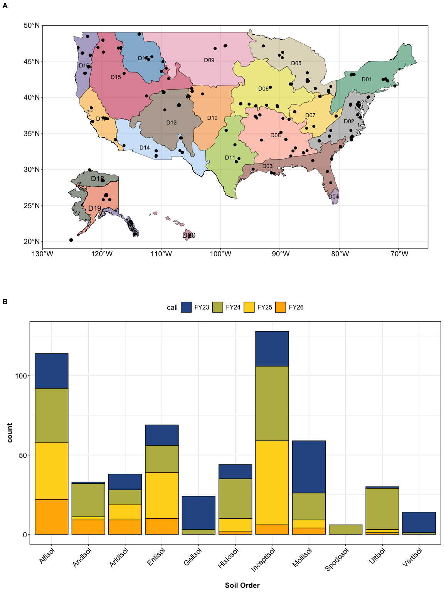
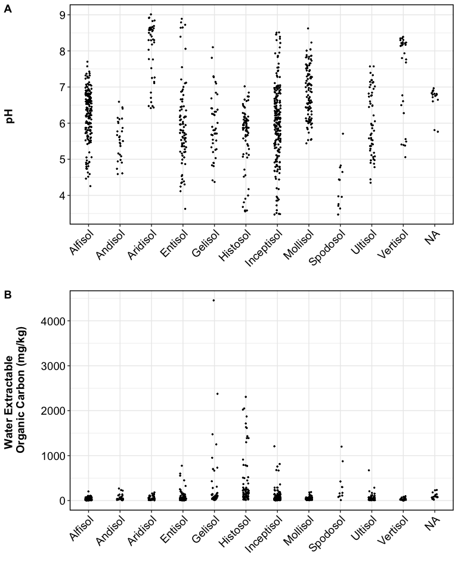

Data Descriptor - Manuscript Figures
================

------------------------------------------------------------------------

## MAP AND SAMPLE COUNT

<!-- -->

How many sites and cores were sampled?

    ## [1] "number of projects"

| call |   n |
|:-----|----:|
| FY23 |  16 |
| FY24 |  26 |
| FY25 |  17 |
| FY26 |   6 |

total projects = 65

    ## [1] "number of sampling sets"

| call |   n |
|:-----|----:|
| FY23 | 145 |
| FY24 | 206 |
| FY25 | 145 |
| FY26 |  63 |

total sampling sets = 559

    ## [1] "summary by soil orders"

| soil_type  |   n | percent |
|:-----------|----:|--------:|
| Alfisol    | 114 |    20.4 |
| Andisol    |  33 |     5.9 |
| Aridisol   |  38 |     6.8 |
| Entisol    |  69 |    12.3 |
| Gelisol    |  24 |     4.3 |
| Histosol   |  44 |     7.9 |
| Inceptisol | 128 |    22.9 |
| Mollisol   |  59 |    10.6 |
| Spodosol   |   6 |     1.1 |
| Ultisol    |  30 |     5.4 |
| Vertisol   |  14 |     2.5 |

------------------------------------------------------------------------

## BGC data

<!-- -->

------------------------------------------------------------------------

## FTICR

<!-- -->

| sample_name | Amino Sugar | Carbohydrate | Cond Hydrocarbon | Lignin | Lipid | Other | Protein | Tannin | Unsat Hydrocarbon |
|:---|---:|---:|---:|---:|---:|---:|---:|---:|---:|
| 60933_2_TOP | 2.57 | 2.05 | 11.22 | 44.59 | 4.72 | 8.61 | 14.37 | 11.78 | 0.1 |
| 60933_2_BTM | 4.18 | 3.67 | 4.48 | 39.04 | 7.89 | 8.60 | 24.30 | 7.45 | 0.4 |

<!-- -->

------------------------------------------------------------------------

## HYPROP

<!-- -->

------------------------------------------------------------------------

## Session Info

Session Info

Date run: 2026-04-11

    ## R version 4.5.0 (2025-04-11)
    ## Platform: aarch64-apple-darwin20
    ## Running under: macOS 26.3.2
    ## 
    ## Matrix products: default
    ## BLAS:   /Library/Frameworks/R.framework/Versions/4.5-arm64/Resources/lib/libRblas.0.dylib 
    ## LAPACK: /Library/Frameworks/R.framework/Versions/4.5-arm64/Resources/lib/libRlapack.dylib;  LAPACK version 3.12.1
    ## 
    ## locale:
    ## [1] en_US.UTF-8/en_US.UTF-8/en_US.UTF-8/C/en_US.UTF-8/en_US.UTF-8
    ## 
    ## time zone: America/New_York
    ## tzcode source: internal
    ## 
    ## attached base packages:
    ## [1] stats     graphics  grDevices utils     datasets  methods   base     
    ## 
    ## other attached packages:
    ##  [1] sf_1.0-21           whistledown_0.1.0   googlesheets4_1.1.1
    ##  [4] soilpalettes_0.1.0  PNWColors_0.1.0     magrittr_2.0.3     
    ##  [7] lubridate_1.9.4     forcats_1.0.0       stringr_1.5.1      
    ## [10] dplyr_1.2.0         purrr_1.0.4         readr_2.1.5        
    ## [13] tidyr_1.3.2         tibble_3.3.1        ggplot2_4.0.2      
    ## [16] tidyverse_2.0.0    
    ## 
    ## loaded via a namespace (and not attached):
    ##  [1] ade4_1.7-23         tidyselect_1.2.1    farver_2.1.2       
    ##  [4] Biostrings_2.78.0   S7_0.2.0            fastmap_1.2.0      
    ##  [7] phyloseq_1.54.0     janitor_2.2.1       digest_0.6.37      
    ## [10] timechange_0.3.0    lifecycle_1.0.5     cluster_2.1.8.1    
    ## [13] survival_3.8-3      compiler_4.5.0      rlang_1.1.7        
    ## [16] tools_4.5.0         igraph_2.1.4        yaml_2.3.10        
    ## [19] data.table_1.17.0   knitr_1.50          labeling_0.4.3     
    ## [22] bit_4.6.0           classInt_0.4-11     plyr_1.8.9         
    ## [25] RColorBrewer_1.1-3  KernSmooth_2.23-26  withr_3.0.2        
    ## [28] BiocGenerics_0.56.0 grid_4.5.0          stats4_4.5.0       
    ## [31] googledrive_2.1.1   multtest_2.66.0     biomformat_1.38.0  
    ## [34] e1071_1.7-16        Rhdf5lib_1.32.0     scales_1.4.0       
    ## [37] iterators_1.0.14    MASS_7.3-65         cli_3.6.5          
    ## [40] vegan_2.7-1         rmarkdown_2.29      crayon_1.5.3       
    ## [43] generics_0.1.3      rstudioapi_0.17.1   reshape2_1.4.4     
    ## [46] tzdb_0.5.0          rhdf5_2.54.1        DBI_1.2.3          
    ## [49] ape_5.8-1           proxy_0.4-27        splines_4.5.0      
    ## [52] parallel_4.5.0      cellranger_1.1.0    microViz_0.12.7    
    ## [55] XVector_0.50.0      vctrs_0.7.1         Matrix_1.7-3       
    ## [58] jsonlite_2.0.0      IRanges_2.44.0      hms_1.1.3          
    ## [61] S4Vectors_0.48.0    bit64_4.6.0-1       foreach_1.5.2      
    ## [64] units_0.8-7         glue_1.8.0          codetools_0.2-20   
    ## [67] cowplot_1.1.3       stringi_1.8.7       gtable_0.3.6       
    ## [70] pillar_1.10.2       rhdf5filters_1.22.0 htmltools_0.5.8.1  
    ## [73] Seqinfo_1.0.0       R6_2.6.1            vroom_1.6.5        
    ## [76] evaluate_1.0.3      Biobase_2.70.0      lattice_0.22-6     
    ## [79] snakecase_0.11.1    gargle_1.5.2        class_7.3-23       
    ## [82] Rcpp_1.1.1          permute_0.9-7       nlme_3.1-168       
    ## [85] mgcv_1.9-1          xfun_0.53           fs_1.6.6           
    ## [88] pkgconfig_2.0.3

